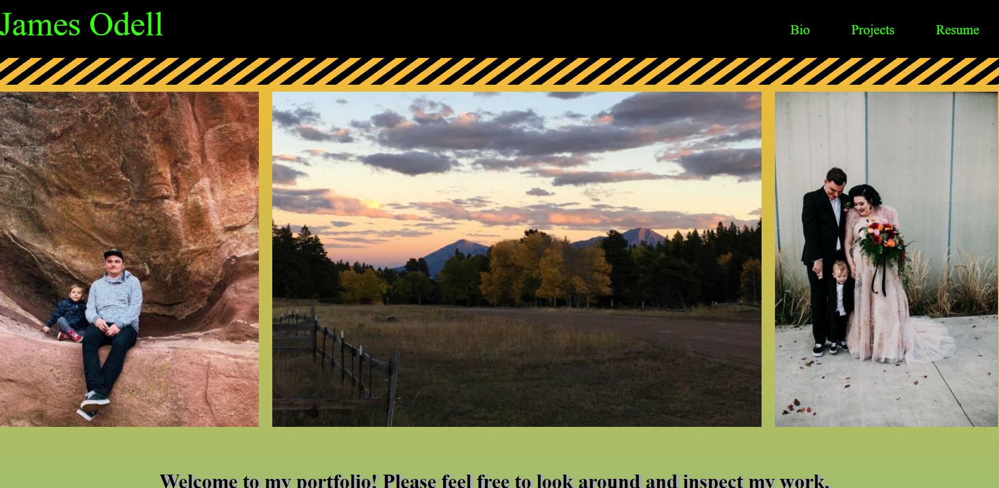

# My Portfolio

* Welcome to my protfolio!

#### Table of Contents
* [Project Description](#project-description)
* [Installation Instructions](#installation-instructions)
* [Usage](#usage-information)
* [Contributor Guidelines](#contributor-guidelines)
* [Code of Conduct](#code-of-conduct)
* [Test Instructions](#test-instructions)
* [License](#license)
* [App Link](#app-link)
* [Future Development](#future-development)
* [Questions](#questions)
* [Deployment Image](#deployment-image)

## Project Discription
* This is my portfolio. I have been learning Full Stack Flex development through the University of Denvers Coding Bootcamp. In my protfolio you will see some of the coding languages I have leardned. This is an on going piece of work for me, because i will continue to learn new thisng through my coding programe. I have started chaning some things on my page from my original portfolio. The changes I have made are adding Bootstrape and Jquary to make my page more dynamic. 

## Installation
* No Installation is required for this site.

## Usage
* This page is built with a navigationbar to send you to my personal information. There is a Bio, Projects and Links section on my page. Also there is a contact area at the footer, that is set up to send a users information to localstorage. I would like to get this function to send to my email, but I am working on that. 

## Contributor Guidelines
* Contribution rules are under the Code of Conduct section

## Code of Conduct
* [Contributor Code of Conduct](https://www.contributor-covenant.org/version/2/0/code_of_conduct/code_of_conduct.md)

## Test Instructions
* No test required

## License
* MIT License

## App Link
* [My Portfolio](https://jameso1231.github.io/myPortfolio/index.html)

## Future Development
* I would like to continue to add more dynamic elements from Bootstarp, and add some more effects using Javascript. I am looking forward to learning React that way I can really dive in and rebuild this page.

## Questions
* For additional help or questions about collaboration, please reach out to jpodell21@gmail.com
* Follow me on Github at 
* [JamesO1231](http://github.com/JamesO1231)

## Deployment Image

